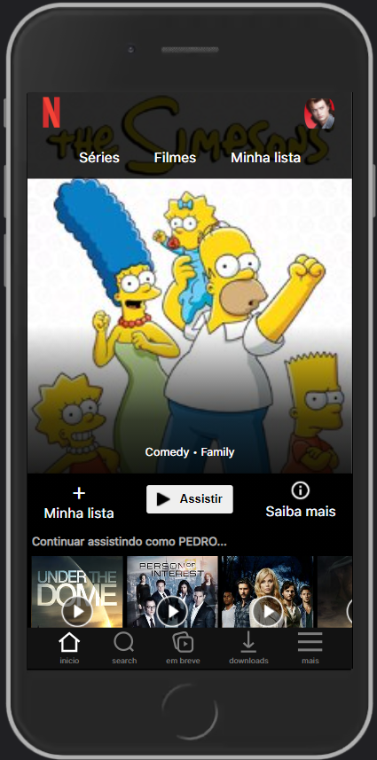
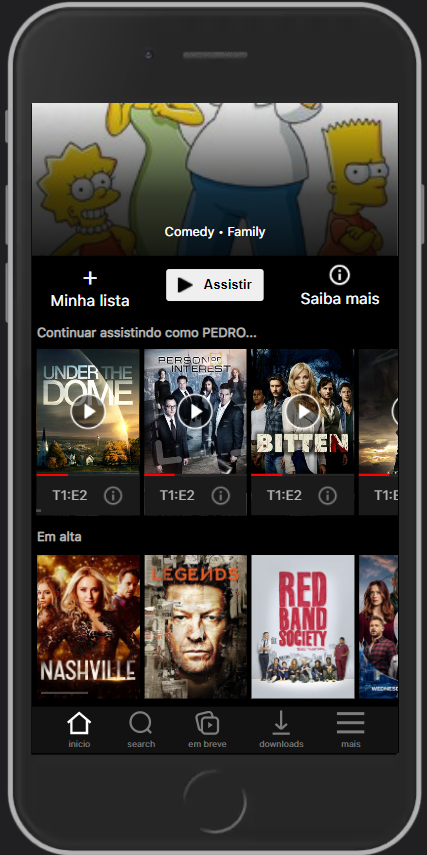
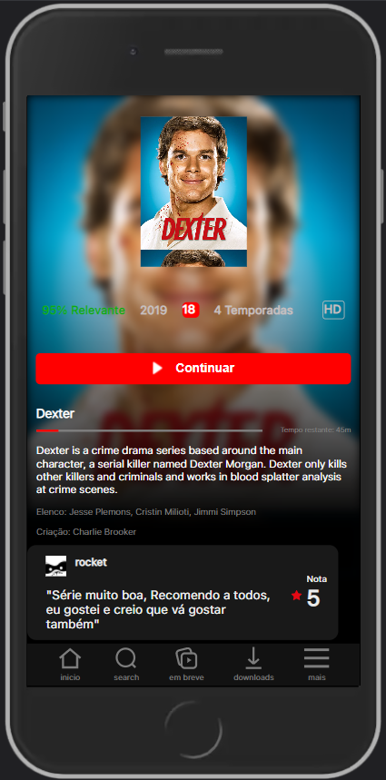
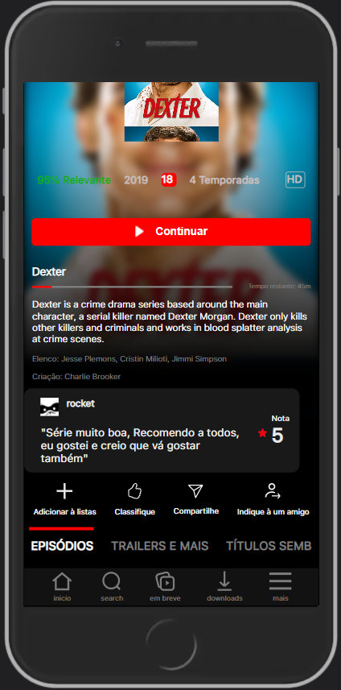
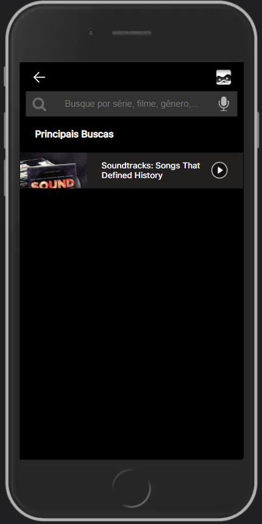
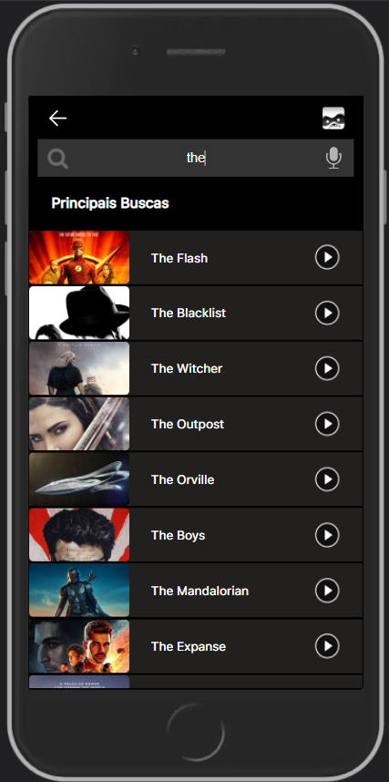

<h1 align="center">
    Netflix Clone
</h1>
  <h3 align="center"> Project developed as part of the Web Development Course by Estartando Devs.</h3>
 

# 🚀 Technologies

This project aims to list the information of a Github user.

- [ReactJS](https://reactjs.org/)
- [react-router-dom](https://github.com/ReactTraining/react-router)
- [node-sass](https://www.npmjs.com/package/node-sass)
- [VS Code](vscode) with [EditorConfig](vceditconfig) and [ESLint](vceslint)

## Screens

  <table>
    <tr>
      <td></td>
      <td></td>
    </tr>
    <tr>
      <td></td>
      <td></td>
    </tr> 
    <tr>
      <td></td>
      <td></td>
    </tr> 
  </table>
  
## 👋 How to use

You need to use Nodejs.

Clone the project

` $ git clone https://github.com/Lud-ic/Clone-Netflix-2.git`

Install dependencies

` $ npm install or yarn`

Start app

` $ npm start or yarn start`

## 📝 License

N/A

---

Made by Equipe 2 - Estartando Devs 👋 [Get in touch!](https://estartandodevs.com.br/)
- [Henrique Calenzo](https://github.com/henriquecalenzoo)
- [Ludmila Magalhães](https://github.com/Lud-ic)
- [Charles Carris](https://github.com/Charles-504)
